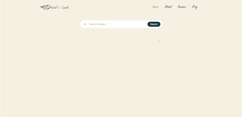

# Let's Cook

## Table of contents

- [Overview](#overview)
  - [Screenshot](#screenshot)
  - [Links](#links)
- [Built with](#built-with)
- [Useful resources](#useful-resources)
- [Author](#author)
- [Acknowledgments](#acknowledgments)

## Overview

This is a themealdb API-based project in which I utilized HTML, CSS, and Javascript. By searching on this website, a visitor can locate any recipe. The visitor also discovers all of the ingredients for the foraged dish and a video of the cooking procedure.

### Screenshot

Desktop View

    <table>
     <tr>
         <td style="padding:2px">
             
           </td>
            <td style="padding:2px">
             
            </td>
            <td style="padding:2px">
             
            </td>
        </tr>
    </table>

Mobile View

     

          
     

     

          
     

     

          
     

### Links

- Code URL: [https://github.com/Mozahidul01/Let-s-cook]

- Live Site URL: [https://let-s-cook.pages.dev/]

### Built with

- HTML5
- CSS3
- Bootstrap 5
- JavaScript
- API

### Useful resources

- [TheMealDB](https://www.themealdb.com/api.php) - I have used this API to collect data.
- [Bootstrap](https://getbootstrap.com/docs/5.2/getting-started/introduction/) - I have used bootstrap as css framework.

## Author

- [Website](https://www.mozahidul.com)
- [Github](https://github.com/mozahidul01)
- [LinkedIn](https://www.linkedin.com/in/mozahidul01/)
- [Facebook](https://facebook.com/mozahidul01)
